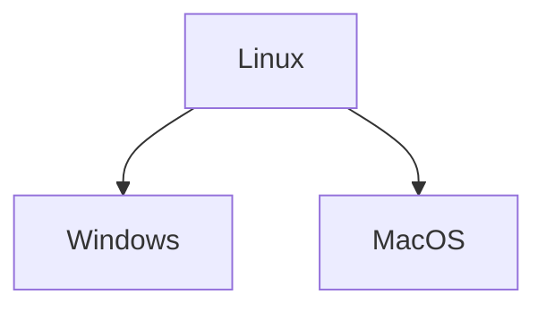
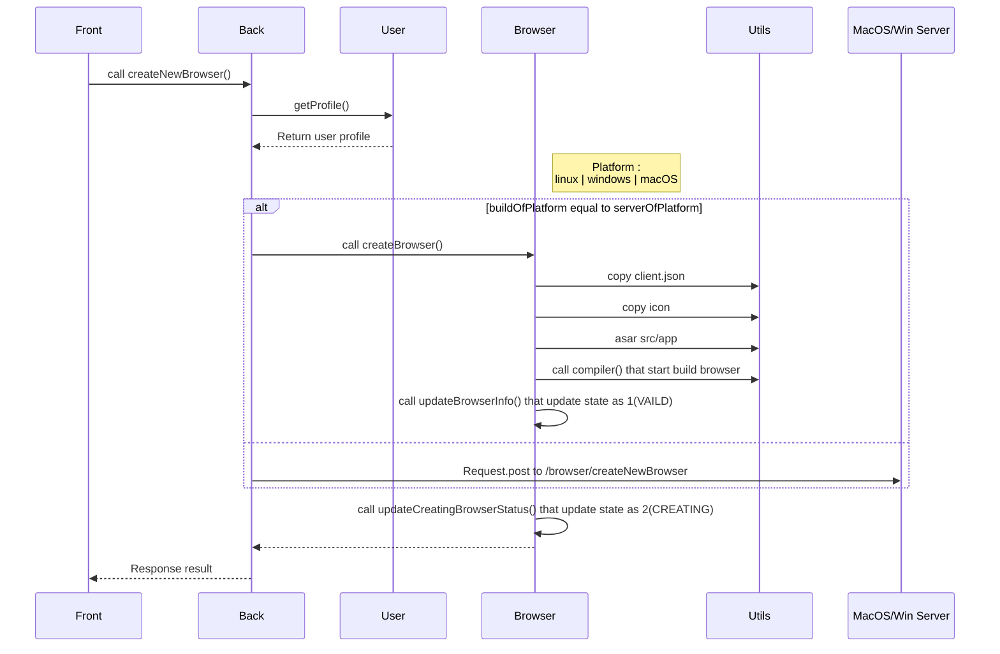

## 生成安全瀏覽器API

---
### Browser service 各平台佈署


> * 安全瀏覽器打包工具是**Electron-builder** ，是一個可以將electron打包成應用程式的工具，但目前為止(2018/12/24)業務需求還不需要要生成linux的應用程式，所以目前只產出Windows與MacOS兩個版本。
> * 在Linux不需要執行打包的動作，目前設計上把Linux那台server當成是前台打向後台的入口，由它來決定前台request是要生成MacOS或Windows版本，判斷後再用Request post打向要生成的platform
> * 佈署的部分Browser/service這個項目都需要佈署在這三台上，而上一點提到Linux不需要執行打包的動作，所以Browser/safetybrowser這個項目除了linux這台server，其他兩個server都需要佈署。


---
### 跨平台生成流程

```puml

title Create Browser

start

:Create Browser;

if (判斷生成的platform與server是否一樣) then (yes)
  : 執行Browser.createBrowser;
else (no)
  :打Post 到該Platform的server;
  note right
    目前platform 只支援 mac 與 windows
    主server 目前是架設在ubuntu，是online tool 主要對的server
    由主server 來指派這次要生成的程序要由哪台機器處理

  end note

  :copy icon到該台主機;
  note right: upload/icon 只有主Server有而已，所以需要複製一個到要執行builder 的機器

  :上傳build 完的setup 回主server;
  note right: 通常是linux 那台

endif


stop

```
---
### 生成程序循序圖


